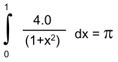
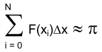
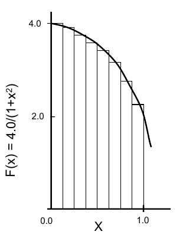

# Pi - Integral

Mathematically, we have:

We can approximate the integral as a sum of rectangles:

Where each rectangle has width Dx and height F(xi) at the middle of interval i.

This program computes the integral of `4 / (1+x*x)` from 0 to 1.  The value of this integral is pi.

The code is based on Tim Mattson's (11/99) original implementation.
