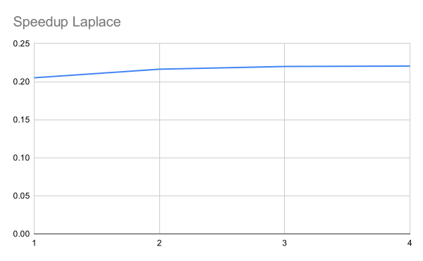

# Relatório Exercício Programa 2

<!-- Identificação do aluno.
Tabela com os tempos de execução, speedup e eficiência.
Gráfico de speedup.
Breve discussão sobre os resultados. -->

<!-- ## Identificação -->

Nome: Luís Henrique Puhl de Souza\
RA: 1141565

## Objetivo

Paralelizar a solução da equação de transferência de calor de Laplace pelo
método de Jacobi usando **Pthreads**.

### Método

Com o
[programa exemplo](https://github.com/HPCSys-Lab/HPC-101/tree/main/examples/laplace)
análise do problema e implementação com Pthreads.
O problema pode ser dividido em blocos, cada thread responsável por um bloco,
ou ser dividido em ciclos, cada ciclo contendo uma coluna.
Para esta avaliação utiliza-se matrizes de 100 x 100.
Para cada versão paralela deve-se avaliar com 1, 2, 3 e 4 _threads_.

<!-- - Executar o cálculo de Pi com número de passos igual a 1000000000 (um bilhão).
- Pthread variando o número de threads em 1,2,5,10,20 e 40.
- OpenMP variando o número de threads em 1,2,5,10,20 e 40. -->

## Resultados

### Tabela de tempos de execução

40342 iterations and error of 9.999553e-06

<!-- report-1.txt:./laplace_que Kernel executed in  seconds with 40342 iterations and error of 9.999553e-06
report-2.txt:./laplace_que Kernel executed in  seconds with 40342 iterations and error of 9.999553e-06
report-3.txt:./laplace_que Kernel executed in  seconds with 40342 iterations and error of 9.999553e-06
report-4.txt:./laplace_que Kernel executed in  seconds with 40342 iterations and error of 9.999553e-06 -->

| Implementação | Processadores | tempo (segundos)  | _Speedup_     |
|:---           |:---           |----:              |----:          |
| Sequencial    | -             | 5.313575e+00      | -             |
| Ciclos (fila) | 1             | 2.591295e+01      | 0.21          |
| Ciclos (fila) | 2             | 2.456326e+01      | 0.22          |
| Ciclos (fila) | 3             | 2.416457e+01      | 0.22          |
| Ciclos (fila) | 4             | 2.410381e+01      | 0.22          |

Onde:

- Processadores é o número (parâmetro p) de processadores (_threads_) utilizado;
- _Speedup_ é definido como o tempo sequencial (serial) dividido pelo tempo
  paralelo (`S_time/P_time`), neste caso o tempo sequencial é `16.061297` e o
  tempo paralelo depende da implementação e do número de processadores.
  Indica o ganho de tempo em relação à implementação serial;
- Trabalho (_Work(n,p)_) é o número de processadores utilizados multiplicado pelo
  tempo utilizado (`p * P_time`).
  Indica o custo do processamento paralelo;
- Eficiência (_Efficiency(n,p)_), similar ao _speedup_, é o tempo serial
  dividido pelo trabalho (`S_time / work`).
  Indica o quão bem utilizado foi o tempo de processamento.

### Gráfico de Speedup

## Conclusão

Esta implementação foi executada em um notebook com intel *i7* com apenas 4
CPUs, no entanto nenhum _speedup_ foi observado, mais precisamente houve aumento
no tempo de execução.
Este comportamento indica falha no processo de paralelização da implementação,
adição de complexidade sem nenhum ganho de desempenho.

Outra implementação com blocos foi construída mas não passou nos testes básicos
pois um erro de condição de corrida não foi encontrado ainda.
