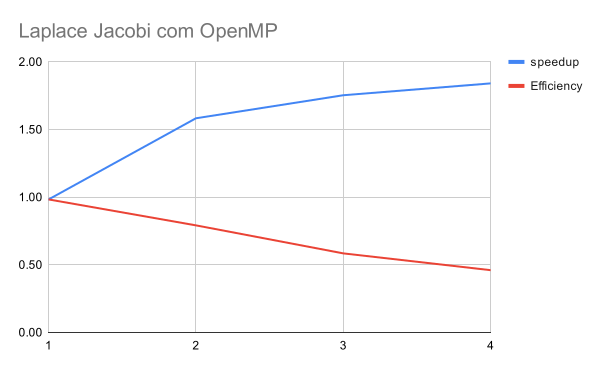
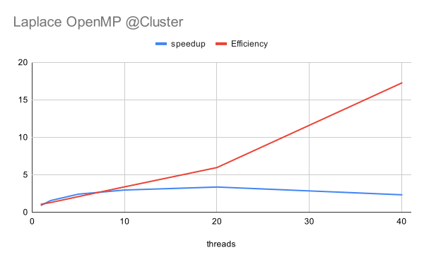

# EP3 Laplace Jacobi com OpenMP

<!-- Identificação do aluno.
Tabela com os tempos de execução, speedup e eficiência.
Gráfico de speedup.
Breve discussão sobre os resultados. -->

<!-- ## Identificação -->

Nome: Luís Henrique Puhl de Souza\
RA: 1141565

## Objetivo

Paralelizar a solução da equação de transferência de calor de Laplace pelo
método de Jacobi usando **OpenMP**.

### Método

Com o
[programa exemplo](https://github.com/HPCSys-Lab/HPC-101/tree/main/examples/laplace)
análise do problema e implementação com OpenMP.
A implementação original é decorada com instruções `#pragma omp`, com destaque
para o laço principal, onde utiliza-se uma redução `max`, dois valores privados
(que podem não ser necessários por conta de seu escopo), e uma modificação do
escalonador reforçando a divisão em blocos onde cada bloco é uma linha.

```c
while ( err > CONV_THRESHOLD && iter <= ITER_MAX ) {
    err = 0.0;
    #pragma omp parallel for reduction(max: err) private(i,j) schedule(static)
    for (i = 1; i < size-1; i++) {
        for (j = 1; j < size-1; j++) {
            new_grid[i][j] = 0.25 * (grid[i][j+1] + grid[i][j-1] +
                                        grid[i-1][j] + grid[i+1][j]);
...
```

Para esta avaliação utilizaram-se dois ambientes: Local e Cluster.
No ambiente Local o tamanho da matriz escolhida é 300x300 e a versão paralela
avaliada com 1, 2, 3 e 4 _threads_.
No ambiente Cluster o tamanho da matriz escolhida é 500x500 e a versão paralela
avaliada com 1, 2, 5, 10, 20 e 40 _threads_.

## Resultados
### Local

Tamanho da matrix 300x300.
Tempo sequencial 14.79s.

| threads   | time (s)  | speedup   | work          | Efficiency    |
| :--       | :--       | :--       | :--           | :--           |
| 1         | 15.04     | 0.98      | 15.041614     | 0.98          |
| 2         | 9.34      | 1.58      | 18.683764     | 0.79          |
| 3         | 8.43      | 1.75      | 25.303989     | 0.58          |
| 4         | 8.03      | 1.84      | 32.13268      | 0.46          |



### Cluster

Tamanho da matrix 500x500.
Tempo sequencial 34.076459

| threads   | time (s)  | speedup       | work          | Efficiency    |
| :--       | :--       | :--           | :--           | :--           |
| 1         | 36.467424 | 0.9344355938  | 36.467424     | 1.070164714   |
| 2         | 21.924057 | 1.554295311   | 43.848114     | 1.286756761   |
| 5         | 14.161125 | 2.406338409   | 70.805625     | 2.077845735   |
| 10        | 11.519006 | 2.958281209   | 115.19006     | 3.38034125    |
| 20        | 10.148357 | 3.357830139   | 202.96714     | 5.956227435   |
| 40        | 14.689786 | 2.319738286   | 587.59144     | 17.24332449   |



<!-- ## Conclusão -->
