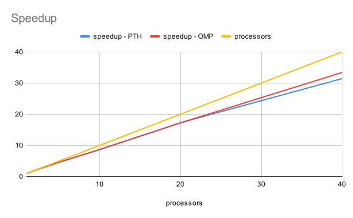

# Relatório Exercício Programa 1

<!-- Identificação do aluno.
Tabela com os tempos de execução, speedup e eficiência.
Gráfico de speedup.
Breve discussão sobre os resultados. -->

<!-- ## Identificação -->

Nome: Luís Henrique Puhl de Souza\
RA: 1141565

## Objetivo

Realizar a execução de um _job_ no cluster OpenHPC da UFSCar, bem como
configurar experimentos de escalabilidade e gerar relatórios.

### Método

Com o
[programa exemplo](https://github.com/HPCSys-Lab/HPC-101/tree/main/examples/pi-integral)
que calcula o a constante Pi pelo método iterativo.
<!-- (computando a integral da
função `4 / (1+x*x)` de 0 à 1 por meio de soma de áreas de retângulos), baseado
na implementação de Tim Mattson (11/99), criar um _container Singularity_ e um
_job script_ para averiguar o tempo utilizado por cada tipo de implementação com
diferentes números de processadores (_threads_). -->
O programa, por ser uma aproximação iterativa.
<!-- , tem como parâmetro o número de
iterações, onde quanto maior este parâmetro, mais cálculos são feitos tendo um
resultado melhor porém mais tempo é necessário para fazer estes cálculos. -->
Para esta avaliação utiliza-se 1000000000 (um bilhão).
Três tipos de implementação são fornecidas: sequêncial, paralela com Pthread e
paralela com OpenMP.
Para cada versão paralela deve-se avaliar com 1, 2, 5, 10, 20 e 40 _threads_.

<!-- - Executar o cálculo de Pi com número de passos igual a 1000000000 (um bilhão).
- Pthread variando o número de threads em 1,2,5,10,20 e 40.
- OpenMP variando o número de threads em 1,2,5,10,20 e 40. -->

## Resultados

### Tabela de tempos de execução

| Implementação | Processadores | tempo (segundos)  | _Speedup_     | Trabalho  | Eficiência    |
|:---           |:---           |----:              |----:          |----:      |----:          |
| Sequencial    | -             | 16.061297         | -             | -         | -             |
| Pthread       | 01            | 16.047649         | 1.000850467   | 16.047649 | 1.000850467   |
| Pthread       | 02            | 8.03185           | 1.999700816   | 16.0637   | 0.9998504081  |
| Pthread       | 05            | 3.429154          | 4.683749111   | 17.14577  | 0.9367498223  |
| Pthread       | 10            | 1.855043          | 8.65818043    | 18.55043  | 0.865818043   |
| Pthread       | 20            | 0.9308            | 17.2553685    | 18.616    | 0.862768425   |
| Pthread       | 40            | 0.510899          | 31.43732323   | 20.43596  | 0.7859330807  |
| OpenMP        | 01            | 16.050153         | 1.000694324   | 16.050153 | 1.000694324   |
| OpenMP        | 02            | 8.031462          | 1.999797422   | 16.062924 | 0.9998987108  |
| OpenMP        | 05            | 3.511448          | 4.573981161   | 17.55724  | 0.9147962322  |
| OpenMP        | 10            | 1.855881          | 8.654270937   | 18.55881  | 0.8654270937  |
| OpenMP        | 20            | 0.93232           | 17.22723636   | 18.6464   | 0.8613618178  |
| OpenMP        | 40            | 0.480989          | 33.3922335    | 19.23956  | 0.8348058376  |

Onde:

- Processadores é o número (parâmetro p) de processadores (_threads_) utilizado;
- _Speedup_ é definido como o tempo sequencial (serial) dividido pelo tempo
  paralelo (`S_time/P_time`), neste caso o tempo sequencial é `16.061297` e o
  tempo paralelo depende da implementação e do número de processadores.
  Indica o ganho de tempo em relação à implementação serial;
- Trabalho (_Work(n,p)_) é o número de processadores utilizados multiplicado pelo
  tempo utilizado (`p * P_time`).
  Indica o custo do processamento paralelo;
- Eficiência (_Efficiency(n,p)_), similar ao _speedup_, é o tempo serial
  dividido pelo trabalho (`S_time / work`).
  Indica o quão bem utilizado foi o tempo de processamento.

### Gráfico de Speedup

## Conclusão

Esta implementação, quando executada no ambiente HPC da UFSCar, mostra o
comportamento comum no _speedup_ para problemas paralelizáveis, ou seja, o
_speedup_ melhora com a adição de cada processador com exclusão de um pequeno
custo, também proporcional, da parte serial do programa.
No caso a versão com OpenMP foi marginalmente mais eficiente para os
experimentos com mais de 10 processadores.
